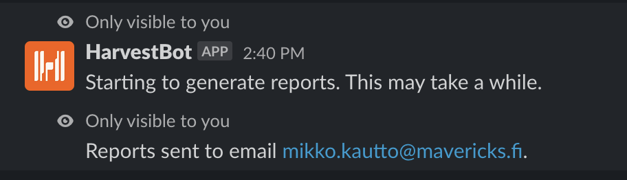

# Harvestbot

[](https://greenkeeper.io/)

Slackbot for calculating Harvest balance.

* Harvest user can query her flextime balance using the bot.
* Harvest admins can also generate excel sheets with monthly statistics of all users.
* Supports only Finnish working regulation and public holidays.

Harvestbot is deployed in Google Cloud. Functionality is implemented with Google Cloud functions that can be integrated to Slack service. Emails are sent using [SendGrid](https://sendgrid.com/)-service.


## Usage

**Show flextime balance for current Slack user**

```/flextime```


**Generate monthly statistics excel and send it via email to current Slack user**

```/flextime stats 2019 3```


Statistics sheet displays work time statistics for each company employee. The second tab gives detailed information for billable hours that can be used as the basis for billing.

**Generate time report PDFs and send them via email to the current Slack user**

The report command identifies users by their last names and generates a monthly PDF report for every project for which they have billable entries in the given month. The reports will then be sent via email to the user that entered the command.

```/flextime report 2019 3 virtanen meikäläinen```



## Development

Harvestbot functionality can be triggered from local machine using CLI-interface. Install relevant tools and setup environment variables first.

### Environment setup

* [nvm](https://github.com/creationix/nvm) (or install and activate Node version required in file ./nvmrc)
* [direnv](https://github.com/direnv/direnv) (or manage environment variables as you prefer)
* You need an existing [Google Cloud](https://console.cloud.google.com/) project to run the code.
* [Download key](https://cloud.google.com/docs/authentication/getting-started) in JSON format from cloud console to be able to acccess your project.
* Export relevant Google Cloud configuration variables:

```
# .envrc

# Google cloud project ID
export GCLOUD_PROJECT=XXX

# Google cloud region for cloud functions
export GCLOUD_FUNCTION_REGION=XXX
export FUNCTION_REGION=XXX

# Path to JSON file you created in Google Cloud console
export GOOGLE_APPLICATION_CREDENTIALS=/path/to/file.json

...
```

* If you already have an existing (and deployed) Google Cloud project, you can print out the app current configuration with the decrypt command. 
* For new projects you need to define the configuration data from scratch:
  * Create API token for your Harvest account in [Harvest developer view](https://id.getharvest.com/developers). Your Harvest user needs to have admin-level rights to be able to access all features.
  * Create API key for [SendGrid](https://sendgrid.com/)-service.
  * Fetch company task information with [API request](https://help.getharvest.com/api-v2/tasks-api/tasks/tasks/). You need the task ids for configuring flextime calculation correctly.
* Define following environment variables:

```
# .envrc

...

# Access token you fetched from Harvest developer UI
export HARVEST_ACCESS_TOKEN=XXX

# Harvest account ID you fetched from Harvest developer UI
export HARVEST_ACCOUNT_ID=XXX

# Key you fetched from SendGrid
export SENDGRID_API_KEY=XXX

# Allowed email domains for users
export ALLOWED_EMAIL_DOMAINS=newthings.co,newthin.gs

# Harvest company account specific configurations
# Task id for public holidays
export TASK_ID_PUBLIC_HOLIDAY=123
# Task id for vacation time
export TASK_ID_VACATION=124
# Task id for unpaid leave
export TASK_ID_UNPAID_LEAVE=125
# Task id for sick leave
export TASK_ID_SICK_LEAVE=126
# Task if for sick leave - child's sickness)
export TASK_ID_SICK_LEAVE_CHILDS_SICKNESS=18406328
# Task id for flex leave
export TASK_ID_FLEX_LEAVE=321
# Task id for product/service development
export TASK_ID_PRODUCT_SERVICE_DEVELOPMENT=14245935
```

### Running locally

```
> nvm use 
> npm install
> npm run build
> node ./build/local.js --help
Usage: local [options] [command]

Options:
  -v, --version                 output the version number
  -h, --help                    output usage information

Commands:
  stats <email> <year> <month>                    Send monthly statistics to given email address.
  reports <email> <year> <month> <last names...>  Send monthly billing report to given email address, select consultants by last names
  flextime <email>                                Calculate flex saldo for given user.
  encrypt                                         Encrypt and store app configuration.
  decrypt                                         Decrypt and show app configuration.
```

Example:
```
npm start flextime laura.vuorenoja@newthings.co

> harvestbot@1.0.0 start /Users/lauravuo/work/NewThingsCo/harvestbot
> npm run build && node ./build/local.js "flextime" "laura.vuorenoja@newthings.co"


> harvestbot@1.0.0 build /Users/lauravuo/work/NewThingsCo/harvestbot
> rimraf build/ && babel ./src --out-dir build/ --ignore **/*.test.js

Successfully compiled 20 files with Babel.
[2019-03-17T11:03:20.294Z] info: Calculating flextime for laura.vuorenoja@newthings.co
[2019-03-17T11:03:20.295Z] info: Fetch data for laura.vuorenoja@newthings.co
[2019-03-17T11:03:36.031Z] info: Received range starting from Wednesday, June 7, 2017 to Friday, March 15, 2019
[2019-03-17T11:03:36.034Z] info: Total working hours from range start 3360
[2019-03-17T11:03:36.041Z] info: No warnings!
[2019-03-17T11:03:36.043Z] info: *Your flex hours count: -0.5*
[2019-03-17T11:03:36.043Z] info: All done!
[2019-03-17T11:03:36.043Z] info: *Your flex hours count: -0.5*
[2019-03-17T11:03:36.044Z] info: Latest calendar working day: Friday, March 15, 2019
[2019-03-17T11:03:36.044Z] info: Last time you have recorded hours: Friday, March 15, 2019
[2019-03-17T11:03:36.044Z] info: Current month 82% billable
```

## Deployment

### Google Cloud project setup

You need [Terraform](https://www.terraform.io/) to initialize the cloud resources.

* [Create new project](https://console.cloud.google.com/) in Google Cloud console (or use the one you created when setting up local environment).
* Enable needed APIs for your project in Google Cloud console: Cloud Functions API, Cloud Key Management Service (KMS) API, Cloud Resource Manager API
* Create datastore database (in datastore mode) to your region (in Google Cloud console).
* Download to you computer the Google credentials in JSON format for your project's default service account (GCLOUD_PROJECT_ID@appspot.gserviceaccount.com)
* Make sure the service account has following roles (in Google Cloud Console IAM view): Cloud KMS CryptoKey Encrypter/Decrypter, Editor, Project IAM Admin
* Define following environment variables:
```
export TF_VAR_gcloud_credentials_path=<path_to_service_account_json_file>
export TF_VAR_gcloud_project_region=<gcloud_region>
export TF_VAR_gcloud_project_id=<gcloud_project_id>
export TF_VAR_gcloud_organisation_id=<gcloud_organisation_id>
export TF_VAR_gcloud_member_kms_manager=user:<your_email>
export TF_VAR_gcloud_member_secret_decrypter=serviceAccount:<gcloud_project_id>@appspot.gserviceaccount.com
export TF_VAR_gcloud_service_account_email=<gcloud_project_id>@appspot.gserviceaccount.com
```
* Initialize encryption related resources to Google Cloud using Terraform-tool:
```
cd infra
terraform init
terraform apply
```

### Integrate bot to Slack

1. [Create new Slack App](https://api.slack.com/apps)
2. From the "App Home" tab: make sure that "Messages tab" is turned on and that the "Allow users to send Slash commands and messages from the messages tab" checkbox is selected
2. Configure the slash command that will trigger your bot in the "Slash Commands" tab. The request URL you can fill out later when you have the cloud functions in place.
3. Add permissions for scopes **commands**, **chat:write**, **im:write**, **mpim:write**, **users:read** and **users:read.email** to be able to send messages to your workspace and get the users email addresses.
5. Install the app to your workspace.
6. Record the Slack signing secret and OAuth access token for configuration in later step.

### Storing encrypted app configuration

App configuration should be stored to Google Storage using the encrypt feature of the tool locally.

* Define environment variables described [in setting up the local development](#environment-setup)

* Define settings for Slack integration

```
  #.envrc
  ...

  # Token for accessing the Slack API
  export SLACK_BOT_TOKEN=XXX
  # Secret for confirming that each request comes from Slack by verifying its unique signature.
  export SLACK_SIGNING_SECRET=XXX
  # Channel id for sending the weekly notifications
  export SLACK_NOTIFY_CHANNEL_ID=XXX
```

* The app will pick up the configuration from environment variables and bundle them to a file. Encrypt the first version to Google Storage

```
  npm run init:config
```

After you have successfully stored the configuration for the first time, you can later on save the changed configuration by running:
```
  npm start encrypt
```

Exporting the stored configuration to console output can be done using command "decrypt".

### Cloud functions deployment

The authenticated user should have permissions (at minimum):
* Cloud Functions Developer
* Service Account User

```
echo "Set project"
gcloud --quiet config set project $GCLOUD_PROJECT

echo "Deploy functions"
gcloud functions deploy initFlextime --set-env-vars GCLOUD_PROJECT=$GCLOUD_PROJECT,FUNCTION_REGION=$FUNCTION_REGION --region=$FUNCTION_REGION --format=none --runtime=nodejs12 --trigger-http
gcloud functions deploy calcFlextime --set-env-vars GCLOUD_PROJECT=$GCLOUD_PROJECT,FUNCTION_REGION=$FUNCTION_REGION --region=$FUNCTION_REGION --format=none --runtime=nodejs12 --timeout 540 --trigger-topic flextime
gcloud functions deploy calcStats --set-env-vars GCLOUD_PROJECT=$GCLOUD_PROJECT,FUNCTION_REGION=$FUNCTION_REGION --region=$FUNCTION_REGION --format=none --runtime=nodejs12 --timeout 540 --trigger-topic stats
gcloud functions deploy calcReports --set-env-vars GCLOUD_PROJECT=$GCLOUD_PROJECT,FUNCTION_REGION=$FUNCTION_REGION --region=$FUNCTION_REGION --format=none --runtime=nodejs12 --timeout 540 --trigger-topic reports
gcloud functions deploy sendReminders --set-env-vars GCLOUD_PROJECT=$GCLOUD_PROJECT,FUNCTION_REGION=$FUNCTION_REGION --region=$FUNCTION_REGION --format=none --runtime=nodejs12 --timeout 540 --trigger-http
gcloud functions deploy notifyUsers --set-env-vars GCLOUD_PROJECT=$GCLOUD_PROJECT,FUNCTION_REGION=$FUNCTION_REGION --region=$FUNCTION_REGION --format=none --runtime=nodejs12 --trigger-http
```

When the deployment is done, copy the URL for initFlextime-function (from Google Cloud Console) and paste it to Slack slash command configuration. The format should be something like https://REGION-PROJECT_ID.cloudfunctions.net/initFlextime. Test out the command from Slack and see from Google Cloud Console logs what went wrong :)

### Trigger notifications

Weekly flextime notifications can be triggered using through HTTP interface. See the CI configuration of this project for an example.

### Trigger monthly reminders via Cloud Scheduler

As of 04/2022, the Google Cloud Scheduler only supports the basic cron syntax, so it is not possible to run a job every last day of the month. We have to run the job every day and check if it is the last day of the month in the triggered function.

* Trigger monthly reminders function every day at 13:00 and 18:00
```
gcloud scheduler jobs create http firstReminder --schedule="0 13 * * *" --time-zone Europe/Helsinki --uri=<sendReminders http trigger url> --oidc-service-account-email=<gcloud_project_id>@appspot.gserviceaccount.com
gcloud scheduler jobs create http secondReminder --schedule="0 18 * * *" --time-zone Europe/Helsinki --uri=<sendReminders http trigger url> --oidc-service-account-email=<gcloud_project_id>@appspot.gserviceaccount.com
```
